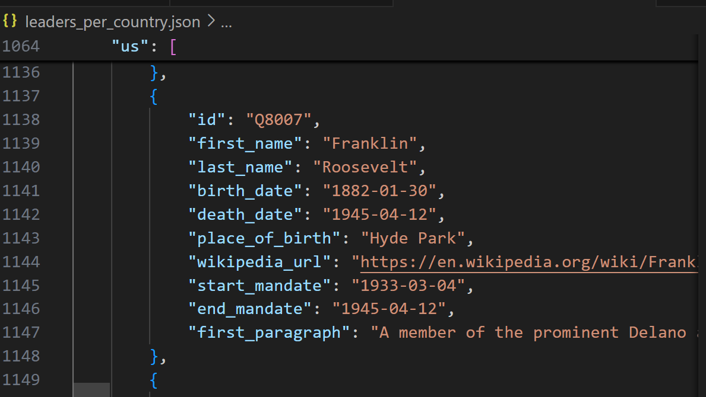

# wikipedia_scraper
## Description

Create a scraper that builds a JSON file with the political leaders of each country you get from this API.

Include in this file the first paragraph of the Wikipedia page of these leaders (you'll retrieve the Wikipedia page URL from the API, which you then have to scrape yourself).

## Installation

0. Setup and preparation

    Repo created: wikipedia-scraper
    Virtual environment created using venv. 
    Added venv in Gitignore.

1. Clone the repository:

git clone https://github.com/Manu1175/wikipedia_scraper.git
cd wikipedia_scraper

2. Run python3 leaders_scraper.py

## Usage

Can scrape through a list of political leaders per country on https://country-leaders.onrender.com and wikipedia websites and stores this in a json file in an orderly way.

## Visuals
